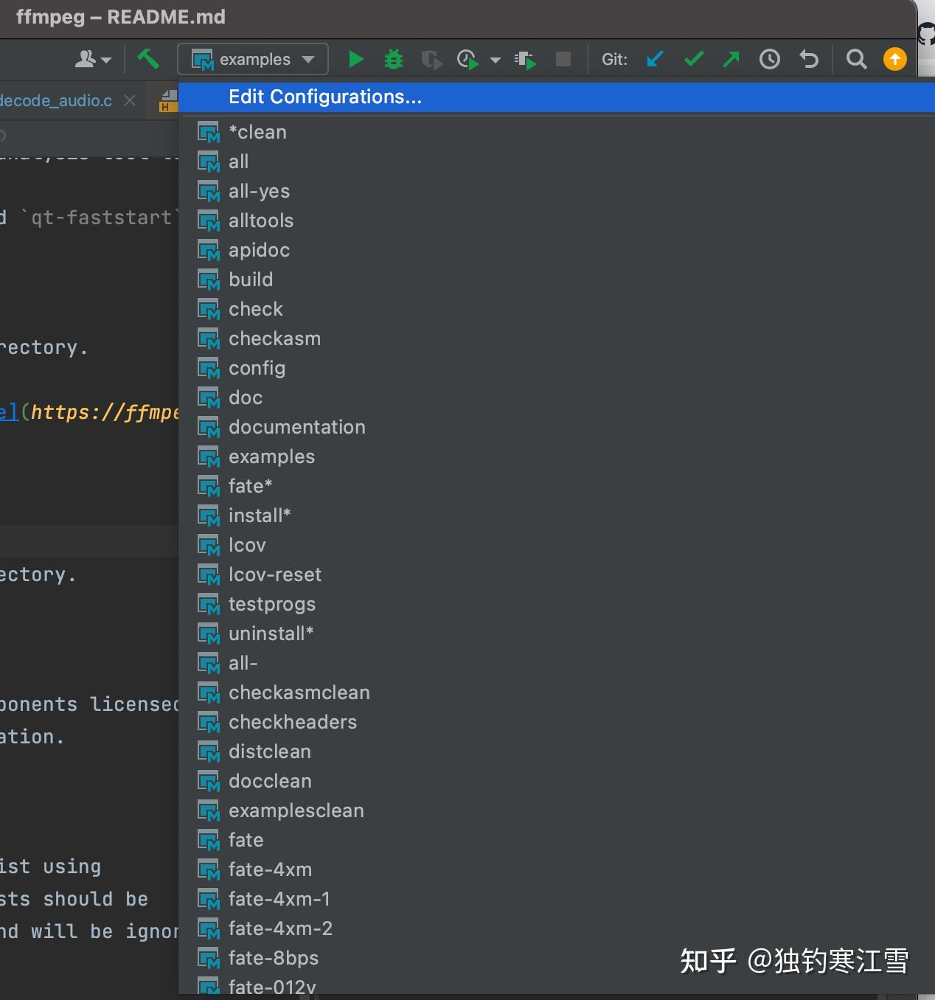
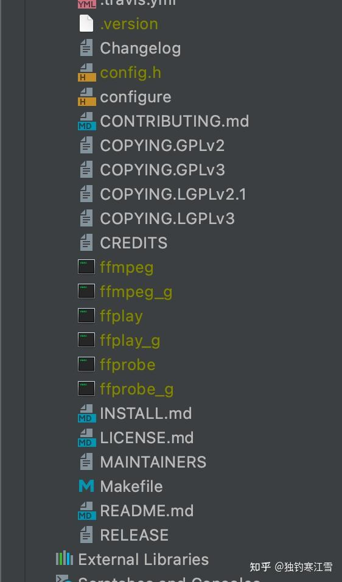
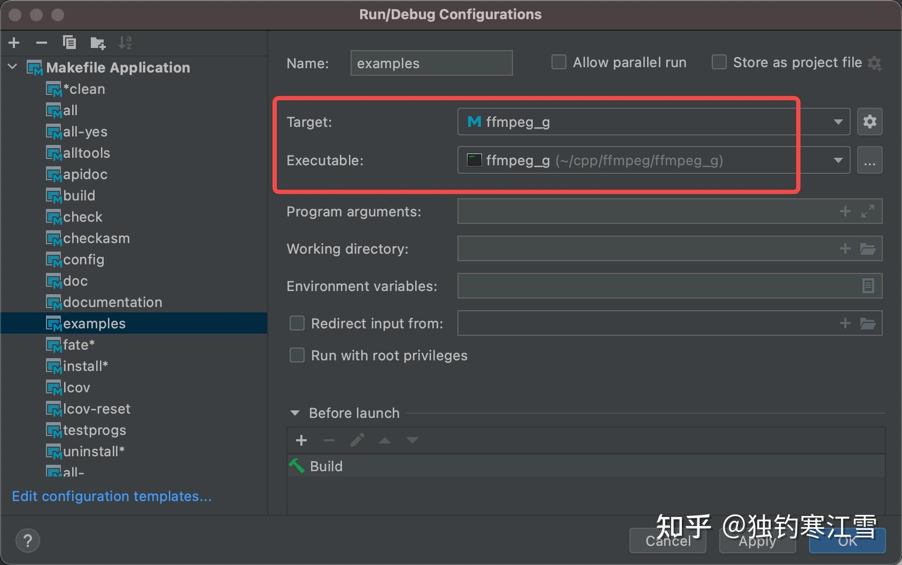

* https://zhuanlan.zhihu.com/p/467257873
---
先把项目拉下来：

```shell
git clone https://git.ffmpeg.org/ffmpeg.git ffmpeg
```
configure选项（这一步是必须的）

```shell
./configure --enable-debug --disable-x86asm --disable-stripping --disable-optimizations
```

enable-debug 是最重要的一处，否则编译会启用优化，导致很多调试符号丢失。其他的选项可以根据configure脚本里面的代码自行查看，不赘述。


enable-debug 是最重要的一处，否则编译会启用优化，导致很多调试符号丢失。其他的选项可以根据configure脚本里面的代码自行查看，不赘述。

configure完成后，用clion打开ffmpeg目录，CLion 将搜索顶级 Makefile（以及 CMakeList.txt 或 compile_commands.json 文件）并建议将其作为项目打开。或者在 Open 对话框中直接将 CLion 指向 Makefile
Â
随后CLion 可能会要求清理项目，这是必需的，因为 Make 构建是增量的，在未清理的项目上运行时，只会编译更新的文件，因此重新加载项目将无法正常进行并会丢失所有未更改的文件。

如无意外，到这里clion已经成功将项目加载为工程结构

* 选中all， 点击构建（左边锤子那个图标），开始编译。
* 
* 其中带_g的就是有调试信息的二进制文件
* * 


